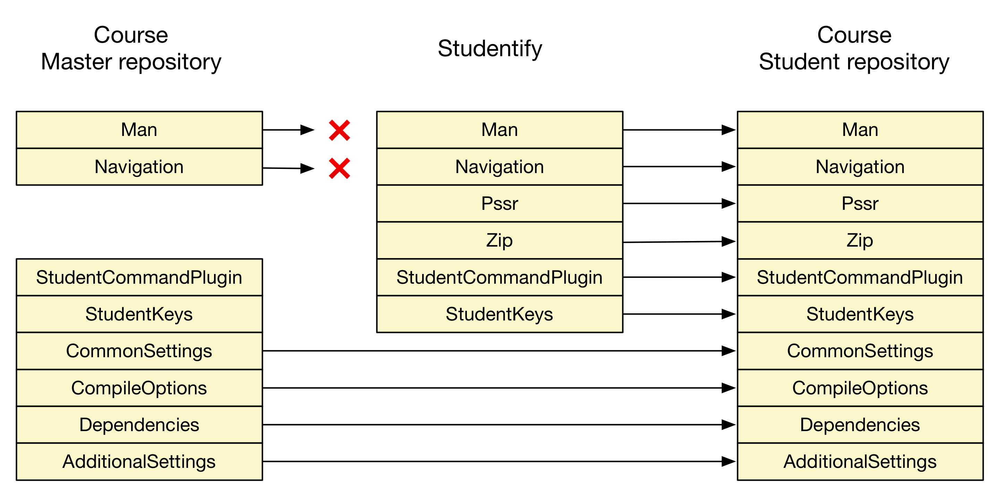

# Course Management - Workflow and tools


## Introduction

Over the last couple of years, a specific set of tools and workflow were used to maintain the exercise source code for Lightbend training courses. Based on the experience gained over time, a new approach has been devised that meets the following objectives:

- Maintain a regular history of course versions in git
	- Easy retrieval of current and older version of a course and allow for *normal* handling of pull requests
 
- Ability to linearize and de-linearize (using the `linearize` and `delinearize` commands respectively) a version of a course exercise main project. A linearized course main can be changed using `git` interactive rebasing

- The ability to run *all* tests for *all* exercises in a course main repository

- Generation of self-contained student exercise repositories using `studentify`
	- The student repository has no external dependencies except:
		- Java (8) SDK
		- sbt (Scala build tool, version 0.13.13 or higher)
		- dependencies defined as part of the course main itself
	- Ability to *save* the current state of an exercise with the possibility to restore it at a later moment
	- Ability to *pull* the complete solution of an exercise
	- Ability to selectively *pull* source files from the complete solution of an exercise
	- Generalization of the use of *manual pages* for all exercises
	- Support for (*Akka*) *multi-jvm* tests
	- Ability to *list* all the exercises in a main repository
	- Ability to *jump* to an exercise based on its sequence number
	- A brief (13') demo of the student repo functionality is available [here](https://www.youtube.com/watch?v=coPOCe8erzc)
	

	
> Note: the course management tools (currently three tools: `studentify`, `linearize` and `delinearize`) have been verified to run on a *nix system (MacOS). No effort was made to make these Windows 'compatible'. If there's a need to run the tools on Windows&reg;, Windows&reg; 10 now has an integrated `bash` shell which should be sufficient to get the tools working. Do note that a `studentified` version of a course should run on *nix and Windows 10 systems. 

> Note: Testing has revealed that some 'older' version of `git` pose problems. `git` version 2.10.0 should be fine.
	
## Course main repository structure

### Getting started

The following section details the structure of a course main project.

To give anyone who wants to use this approach a leg-up, a template project is available [here](https://github.com/lightbend-training/course-master-template). Next:

- Clone the project
- You probably may want to *'re-git'* it:
   - `rm -rf .git`
   - `git init`
- ... and start hacking! 

### Course main set-up

A course main repository is a multi-project sbt build that needs to adhere to a few conventions:

- Each exercise is an sbt project who's name has to start with `exercise_[0-9][0-9][0-9]` followed by a description of the exercise (for example `exercise_001_create_a_class`)
- There should be an `sbt` project containing *common* code with the exact name `common`
- The `build.sbt` file in the root folder of the main repository uses a fixed layout described in more detail below
- There should be a `.sbtopts` file in the root folder of the main repository which sets a number of options that are important when running integration tests.
- README files:
	- There should be a global `README.md` file containing the overall course description for students and a list of `sbt` commands that the user can use to 'navigate' the course.
	- Each exercise project should have a `README.md` file containing a description of the exercise and 'run', 'test' and 'next step' instructions and should be located at `exercises_xxx_.../src/test/resources`
	- The `common` project should have a `README.md` file located under `common/src/test/resources`
	- The `base` project should have a `README.md` file located under `src/test/resources`
	- Note that the `listExercises` command, available on a _studentified_ repo extracts the exercise descriptions from the exercise project name. For example, the exercise project name `exercise_001_create_a_class` generates `1. Exercise 1 > Define A Class` in the output of the command. 
- By default, test code is assumed to be located in a `src/test` folder in each exercise folder. As of `studentify` version 2.0, this has become configurable by creating a file `.student-settings.conf` in the course main repo with a line that sets the `TestCodeFolders` option.

### Course main project structure

The following diagram depicts structure of a course main with 3 exercises:

```
                 base
                   |
        +----------+--------------+----------+
        |          |              |          |
     common   exercise_000_xxx    |     exercise_002_zzz
                                  |
                             exercise_001_yyy 
            
```

Project `base` aggregates *all* projects below it (`common` and all exercise projects)

Furthermore, all exercise projects depend on `common`.

The layout of the `build.sbt` file is quite simple as illustrated for the sample structure in the previous diagram:

```
lazy val base = (project in file("."))
  .aggregate(
    common,
    exercise_000_xxx,
    exercise_001_yyy,
    exercise_002_zzz,
  )
  .settings(CommonSettings.commonSettings: _*)

lazy val common = project.settings(CommonSettings.commonSettings: _*)

lazy val exercise_000_xxx = project
  .settings(CommonSettings.commonSettings: _*)
  .dependsOn(common % "test->test;compile->compile")
  
lazy val exercise_001_yyy = project
  .settings(CommonSettings.commonSettings: _*)
  .dependsOn(common % "test->test;compile->compile")
  
lazy val exercise_002_zzz = project
  .settings(CommonSettings.commonSettings: _*)
  .dependsOn(common % "test->test;compile->compile")

```

The attentive reader will notice references to `CommonSettings.commonSettings`. It is these settings that will allow for the definition of all project specific settings. ***All*** project specific settings should be put under the `project` folder.

It is recommended to use the following file structure in the `project` folder:

```
           ./
            |
            +- build.sbt
            |
            +--/project
                  |
                  +- AdditionalSetting.scala
                  |
                  +- build.properties
                  |
                  +- CommonSettings.scala
                  |
                  +- CompileOptions.scala
                  |
                  +- Dependencies.scala
                  |
                  +- Navigation.scala
                  |
                  +- Man.scala
                  |
                  +- plugins.sbt
                  |
                  +- StudentCommandsPlugin.scala
                  |
                  +- StudentKeys.scala

```

When settings up a new course main repository, the easiest way to get started is to follow the instructions in the _Getting started_ section above. 

> Note: a new command, `mainadm`, has been added to generate the root `build.sbt` file based on the main folder structure. It assumes that all the exercises are in folders named `exercise_\d{3}_.*` (using regular expression specification). See section "The `mainadm` command".

> Note: Many options for generating a course can now be set via configuration. See section `Tweaking tool behaviour via configuration`.

## Course main editing approach

Once the initial set-up of a course main repository has been completed, the question arises about how to evolve it.

There's a recommended workflow and a set of tools that can be used for this.

### Tools

The course management tools contain two utilities that can convert a multi-project course main project with one project per exercise into a so-called '*linearized*' git repository with one commit per exercise. A second command named 'delinearize' performs the opposite conversion: it applies the changes made in the linearized version of the course main on the course main repo itself.

Hence, one can choose different approaches to implement a certain modification to the exercises in the course main.

#### Applying changes to common files

The simplest approach to changing any of the source files in the `common` project, files in the root folder or in the `project` folder, is to apply them directly to these files.

When the changes have been made, it is very easy to verify if all the tests in the different exercises still pass. In an `sbt` session, this can be done by running the `base/test:test` command.

#### Applying changes to exercise projects

Two possible approaches can be utilized.

#### First approach: direct changes to files in course main

One can apply changes directly to files in the exercise project(s) and verify correctness by running, possibly modified, tests. (run `base/test:test` in sbt). In most cases, any change made in a particular exercise, will have an impact on subsequent exercises. As such, making changes implies being able to efficiently search for occurrences of certain classes, methods and variable names. A very nice tool that can assist in this process is the 'Silver Searcher' (<https://github.com/ggreer/the_silver_searcher>). It's basically a `find`/`grep`/`awk` on steroids.

Combined with some simple scripting, many changes can be implemented very efficiently. A video recording showing this approach can be viewed at: [course main editing workflow](https://www.youtube.com/watch?v=yLMPoN13eMM).

Of course, the (best) practice to commit often in `git` applies here.

#### Second approach: applying changes to a linearized version of the course main

In some cases, applying changes to a linearized version of a course main repo may be easier than applying them directly on the main. 

Suppose we have a course main repo and an empty folder that will hold the linearized version of the main repo. Suppose that these are located in folders `/lbt/FTTAS-v1.3.0/fast-track-akka-scala` and `/lbt/Studentify/as-linearized` respectively.

The editing workflow looks as follows:

1. Linearize the main repo: `linearize /lbt/AS-v1.2.0/fast-track-scala-advanced-scala /lbt/Studentify/as-linearized`
> Note: always make sure that, when running `linearize`, the `workspace` and `index` in the course main repository is clean: any modifications in the `index` and `workspace` will not be carried over to the linearized repo. 

2. Apply changes to the linearized repo in `/lbt/Studentify/as-linearized/fast-track-scala-advanced-scala` using git interactive rebasing (e.g. `git rebase -i --root`)
> Note: When `git` gives you the possibility to change the commit message, **don't change it**. Any change to a commit message will result in `delinearize` refusing to do its job. Also, don't add or delete commits in the linearized repo.

3. Test the modified exercise(s) as far as possible in the linearized git repo

4. Apply the changes made in the previous step by delinearizing the linearized repo back on the course main: `delinearize /lbt/AS-v1.2.0/fast-track-scala-advanced-scala /lbt/Studentify/as-linearized/fast-track-scala-advanced-scala`
> Note: always make sure that, when running `delinearize`, the `workspace` and `index` in the course main repository is clean. If this is not the case, modifications in the `index` and `workspace` may be silently overwritten.
5. Run **all** tests on the main repo: `base/test:test`.

6. If the tests pass, commit the changes on the main repo. If they don't, reset the `git` `workspace`/`index` to the last commit that was 'ok' 

7. Repeat this process as often as necessary by repeating the process from step 2 onward.

> Note1: consider making many 'small' changes that are delinearized and commited. Once a successful result is obtained, the linearized repo should be discarded, and, if desired, the sequence of commits that were made during the repetitive execution of this process can be squashed into one or a limited number of commits

> Note2: even though the 'common' (project `common`, `project/*`) content will appear in the delinearized repo, ***don't change them in the linearized repo*** as any change will **not** be brought back to the main repo during delinearization. Apply such changes directly on the course main. 

#### Combining approaches

Of course, the two approaches described above can be combined repeatedly and in different combinations in a workflow. However, when a linearized repo exists and subsequently changes are made to the main repo, the linearized version should be discarded and re-created using `linearize`.

### Selecting a particular *exercise* (sbt project)

It is recommended to use the regular `project` and `projects` `sbt` commands.

`projects` will list all projects in the build. For a course main repo, it will show project `base`, `common` and all of the exercises.

Selecting a particular exercise or project can be done with the `project` command as shown here:

```
[ericloots@Eric-Loots-MBP] $ sbt
 .
 . <elided>
 .
man [e] > akka-collect > initial-state > projects
[info] In file:/Users/ericloots/Trainingen/LightbendTraining/AAS-v1.4.0/advanced-akka-with-scala/
[info] 	   base
[info] 	   common
[info] 	 * exercise_000_initial_state
[info] 	   exercise_001_complete_initial_state
[info] 	   exercise_002_remoting
[info] 	   exercise_003_cluster_events
[info] 	   exercise_004_cluster_aware_routers
[info] 	   exercise_005_cluster_singleton
[info] 	   exercise_006_cluster_sharding
[info] 	   exercise_007_persistent_actors
[info] 	   exercise_008_data_replication

man [e] > akka-collect > initial-state > project exercise_004_cluster_aware_routers
[info] Set current project to exercise_004_cluster_aware_routers (in build file:/Users/ericloots/Trainingen/LightbendTraining/AAS-v1.4.0/advanced-akka-with-scala/)

man [e] > akka-collect > cluster-aware-routers > project common
[info] Set current project to common (in build file:/Users/ericloots/Trainingen/LightbendTraining/AAS-v1.4.0/advanced-akka-with-scala/)
LightbendTraining/AAS-v1.4.0/advanced-akka-with-scala/)

man [e] > akka-collect > initial-state > project exercise_007_persistent_actors
[info] Set current project to exercise_007_persistent_actors (in build file:/Users/ericloots/Trainingen/LightbendTraining/AAS-v1.4.0/advanced-akka-with-scala/)

man [e] > akka-collect > persistent-actors >
```

## Creating student repositories

As mentioned before, the `studentify` command can be used to generate a self-contained repository.

The `studentify` command has a few options to customize the generated repository.

First of all, one can generate a student repo that contains a subset of the exercises available in the course main repo.

This is done by using the `-fe` (first exercise) and `-le` (last exercise) options. Either of them can be omitted resulting respectively in selecting all exercises up-to the last exercise or from the first exercise.

There's also the `-sfe` option that allows one to 'bookmark' an exercise in the generated student repo. When the student runs `sbt`, he/she will be positioned at the selected exercise.

These three options come in handy when a course main contains exercises for more than one course (e.g. `Fast Track to Scala` and `Advanced Scala`)

Finally, there's the `-mjvm` option that will generate a `build.sbt` file that support `Akka`'s `multi-jvm` testing.

> Note: Course main repos that use `multi-jvm` should include the dependencies required for this feature (see the `Advanced Akka with Scala` course for an example).

## Navigating student repositories

To navigate through a student repository you can leverage the following commands:

- `man e` - Displays current exercise instructions.
- `showExerciseId` - Displays the current exercise name.
- `listExercises` - Lists all exercises in course.
- `nextExercise` - Brings new tests and instructions into scope, while preserving your code.
- `prevExercise` - Reverts tests and instructions to the previous state, while preserving your code.
- `gotoFirstExercise` - Jump to the first exercise in the course and bring in tests for that exercise while preserving code.
- `gotoExerciseNr <exercise Nr>` - Jump to exercise `Nr`, bring in tests for that exercise while preserving code.
- `pullSolution` - Overwrites your code with the official solution.
- `saveState` - Create a snapshot of your current code.
- `restoreState <exercise Id>` - Restore the code from a saved snapshot.
- `savedStates` - List all saved states.

## Validating student repositories

While all the tests for a project can be run in the Main project, it is also valuable to verify that all the tests
still run correctly once the repository has been converted to the student version. This can be accomplished using the
`validateStudentRepo.sh` script. To use this script you simply run it and pass in the path to the student repo you want
to validate. For example: `./validateStudentRepo.sh ../FTTS-fast-track-scala`.

When run, this script will advance through each exercise in the student repo. It will pull the solution and run all the
tests against that solution to verify that they work. It completes once it reaches the final exercise.

## Creating Releases

When you are ready to release your student repo into the wild, you can create a versioned zip file to distribute.
This zip file is easily created using the `createRelease.sh` script. To use this script you run it, passing in a path
to the main repo that you want to release. This script will generate the student repo, validate it using the
`validateStudentRepo.sh`, package it into a zip file, and attach a version number to that zip. It also embeds a file in
the zip that contains the version number. This zip file is now ready to distribute.

By default, the version used is "SNAPSHOT". You can specify your own version by using the `-v <Version>` option.

So to release Fast Track to Scala version 2.0.0 you would run a command such as: 
`./createRelease.sh -v 2.0.0 ../FTTS-fast-track-scala`

It is important to note that the final zip name is determined by the name of the repo that you pass in. So in the above
scenario, the final zip generated would be `FTTS-fast-track-scala-exercises-2.0.0.zip`

## The __mainadm__ command

The `mainadm` command was added to allow the following operations on a main repository:

- Delete an exercise
    - Run `mainadm -d  <exercise number> <mainRepo>`
    
    This will delete the exercise from your main repository and re-create the root `build.sbt` file. Note that the numbering of the remaining exercises doesn't change.
    
- Add an exercise by duplicating an existing one and insert it before that exercise
    - Run `mainadm -dib <exercise number> <mainRepo>`
    
    This will duplicate the exercise with the given number and insert it before the specified exercise. In case this leads to a duplicate exercise number, all exercises, starting from the specified exercise, will be renumbered upwards by one. Otherwise, the exercise numbers remain unchanged. The duplicated exercise name will be copied from the specified exercise with `_copy` appended to it. The root `build.sbt` file will be regenerated.
 
- (Re-)generate the root build.sbt file based on the main repo folder structure
     - Run `mainadm -b <mainRepo>` 

- Renumber exercises (with an optional _offset_ and _step_ size between consecutive exercises)
    - Run `mainadm -r [-ro offset] [-rs step] <mainRepo>`
    
    By default, this will renumber all exercises starting from offset 0 with a step size of 1 between consecutive exercises. Optionally, `-ro offset` can be specified to start numbering from that offset. Also, an optional step size between exercises can be specified (`-rs step`). The root `build.sbt` file will be regenerated.

## Tweaking tool behaviour via configuration

Many options can now be set via [Typesafe] configuration.

The reference configuration can be found in `src/main/resources/reference.conf`. 

By default, the tools will look for a file `course-management.conf` in the root folder of your main project. All tools allow you to point to a specific configuration file via a command line option. Simply add `-cfg <configuration-file> to any command.

At present, the following configuration parameters are available:

- `studentify.test-code-folders`: A list of folders in which test code is located. These folders apply across all exercises of you studentified project. It doesn't matter of some exercise doesn't have some or all of these folders: it will just work.
- `studentify.studentify-mode-select`: The mode used to studentify a project. at present, only `classic` mode is available.
- `studentify.studentify-mode-classic.studentified-base-folder`: the name of the folder in which studentified source code will be located. Default is `exercises`. Handy if you want to have a more meaningful name in case you use the tools to generate a studentified version for non-training purposes (e.g. meetups, talks, demos, ...)

> Note: restrictions apply to this name (e.g. no `-` characters, etc.) This isn't checked, so you're warned!

- `studentify.relative-source-folder`: The tools now allow you to have multiple main projects in a single git repository. For example, you might have a java and a Scala version of your code which are put in separate folders each with the same layout as any other "normal" main project. This option allows you to point to the root folder your want to work with (e.g. the java version).

> Note: In the example of a java and a scala version, you might have two corresponding project configuration files and point to the appropriate one by using the `-cfg` command line option.

- `studentify.solution-folder`: name of the folder in the studentified version of the project in which the exercise solution will be hidden. Default is `.cue`.
- `studentify.main-base-project-name`: project name of the root project in your main repo. This name will be selected when the `mainadm` command regenerates the root `build.sbt` file.
- `studentify.studentified-project-name`: equivalent for the name of the root project of a studentified version of your main repo.
- `studentify.console-colors`: Allows one to customise some colors in the output of a studentified project.
- `studentify.studentify-files-to-clean-up`: A list of files/folders that are present in your main repo but that will be deleted from the studentified version of that repo.

## Appendix 1 - Course management tools summary

### studentify

`studentify` generates a *student* repository from a given course main repository.

A student will clone a copy of the generated student repository, load it in his/her favorite IDE (IntelliJ or Scala IDE (Eclipse)).

Using *sbt*, the student can move between exercises by issuing the `nextExercise`, `prevExercise`, `gotoFirstExercise`, `gotoExercise` and `gotoExerciseNr` commands.
Please note that these commands pull only exercise tests and do NOT change other (solution) sources. 
There is the `pullSolution` command that pulls the solution code.

Detailed, per-exercise instructions can be obtained via the `man e` command.

General course instructions can be obtained via the `man` command.

The `listExercises` command will generate a list of exercises and their description.

#### Requirements:

* a main repository and its file-path
* the path to an (empty) folder in which the student distribution will be created
* an optional configuration file `.student-settings.conf` in the course main repository may specify the folders from which test code will be copied. Suppose that we have a course main that has test code in three folders: `src/test`, `ServiceLocatorImpl/test` and `ServiceAdmImpl/test`. Setting the `TestCodeFolders` option as shown below will do the trick:

```
[ericloots@Eric-Loots-MacBook-Pro] $ cat .student-settings.conf
TestCodeFolders=src/test:ServiceLocatorImpl/test:ServiceAdmImpl/test
```

#### Invocation

```
studentify 3.0
Usage: studentify [options] mainRepo out

  mainRepo               base folder holding main course repository
  out                      base folder for student repo
  -mjvm, --multi-jvm       generate multi-jvm build file
  -fe, --first-exercise <value>
                           name of first exercise to output
  -le, --last-exercise <value>
                           name of last exercise to output
  -sfe, --selected-first-exercise <value>
                           name of initial exercise on start
  -cfg, --config-file <value>
                           configuration file
```

#### Example

```
./studentify  /lbt/Studentify/aas-base/advanced-akka-scala \
              /lbt/Studentify/aas-out -mjvm
```

In the above example, a folder `fast-track-akka-scala` will be created under the `out` folder.

> Note: `studentify` will copy over a number of files verbatim from the main build definition and overwrite or create a number of files in the student repo. A diagram, `images/sbtSourceCode.png` provides more details on this.



### linearize

`linearize` will generate a new git project in which every exercise is a commit in the project's history.

This repo can then be utilized to apply changes to the exercises via interactive rebasing.

#### Invocation

```
linearize 3.0
Usage: linearize [options] mainRepo linearRepo

  mainRepo          base folder holding main course repository
  linearRepo          base folder for linearized version repo
  -mjvm, --multi-jvm  generate multi-jvm build file
  -f, --force-delete  Force-delete a pre-existing destination folder
  -cfg, --config-file <value>
                      configuration file
```

#### Example

```
linearize /lbt/FTTAS-v1.3.0/fast-track-akka-scala \
          /lbt/Studentify/fttas-linearized
```

Note that if the destination folder exists, `linearize` will abort. Two options are available: either delete the pre-existing destination folder and re-run the command, or, specify the `-f` command line option: `linearize` will delete the folder (and its contents) before proceeding. 

In the above example, a folder `fast-track-akka-scala` will be created. This folder contains a git repository containing all the course exercises with one commit per exercise. Note that each commit contains an sbt multi-project build. More precise, two projects are defined, `common` and `exercises`.

```
[ericloots@Eric-Loots-MBP] $ cd /lbt/Studentify/fttas-linearized/fast-track-akka-scala
[ericloots@Eric-Loots-MBP] $ git log --oneline
fe111ab exercise_021_fsm
64f1307 exercise_020_akka_extension
8c4bc1a exercise_019_use_ask_pattern
59e16ea exercise_018_become_stash
67206d5 exercise_017_config_dispatcher
4d900a7 exercise_016_use_router
5e90ed0 exercise_015_detect_bottleneck
6424eb2 exercise_014_self_healing
c7e0f8c exercise_013_another_faulty_actor
0ab3f71 exercise_012_custom_supervision
30c10a1 exercise_011_faulty_actor
72e9cf4 exercise_010_lifecycle_monitoring
6accfc2 exercise_009_stop_actor
3140ad7 exercise_008_keep_actor_busy
3372ff7 exercise_007_use_scheduler
cea8563 exercise_006_actor_state
e890cc4 exercise_005_create_child_actors
4684cac exercise_004_use_sender
d95dae6 exercise_003_message_actor
fc818b7 exercise_002_top_level_actor
03bd482 exercise_001_implement_actor
9b00254 exercise_000_initial_state
```

This repository is well suited to apply changes to exercises using interactive rebasing.

#### Note

In each commit, apply changes to files in the `exercises` project.  **Important**: Any changes applied on files outside of the `exercises` folder will be discarded when the repo is `delinearized`. If changes need to be applied outside of the `exercises` folder, apply them directly on the course main instead.

#### Example course editing flow

Let's apply a small change to the course. Let's add a text file named `SampleTextFile.txt` under `exercises/src` in exercise `exercise_009_stop_actor` and remove it again in exercise `exercise_016_use_router`.

```
[ericloots@Eric-Loots-MBP] $ git rebase -i --root
   pick 9b00254 exercise_000_initial_state
   pick 03bd482 exercise_001_implement_actor
   pick fc818b7 exercise_002_top_level_actor
   pick d95dae6 exercise_003_message_actor
   pick 4684cac exercise_004_use_sender
   pick e890cc4 exercise_005_create_child_actors
   pick cea8563 exercise_006_actor_state
   pick 3372ff7 exercise_007_use_scheduler
   pick 3140ad7 exercise_008_keep_actor_busy
   edit 6accfc2 exercise_009_stop_actor
   pick 72e9cf4 exercise_010_lifecycle_monitoring
   pick 30c10a1 exercise_011_faulty_actor
   pick 0ab3f71 exercise_012_custom_supervision
   pick c7e0f8c exercise_013_another_faulty_actor
   pick 6424eb2 exercise_014_self_healing
   pick 5e90ed0 exercise_015_detect_bottleneck
   edit 4d900a7 exercise_016_use_router
   pick 67206d5 exercise_017_config_dispatcher
   pick 59e16ea exercise_018_become_stash
   pick 8c4bc1a exercise_019_use_ask_pattern
   pick 64f1307 exercise_020_akka_extension
   pick fe111ab exercise_021_fsm

   # Rebase fe111ab onto 99ef9f2
```

We apply the change:

```
[ericloots@Eric-Loots-MBP] $ touch exercises/src/SampleTextFile.txt

[ericloots@Eric-Loots-MBP] $ git add -A

[ericloots@Eric-Loots-MBP] $ git rebase --continue

[ericloots@Eric-Loots-MBP] $ rm exercises/src/SampleTextFile.txt

[ericloots@Eric-Loots-MBP] $ git add -A

[ericloots@Eric-Loots-MBP] $ git rebase --continue
```

After applying the change, we `delinearize` the project.

```
delinearize /lbt/FTTAS-v1.3.0/fast-track-akka-scala /lbt/Studentify/fttas-linearized/fast-track-akka-scala
```

Let's see that that did to the (clean) main course repo.

```
[ericloots@Eric-Loots-MBP] $ cd FTTAS-v1.3.0/fast-track-akka-scala/

[ericloots@Eric-Loots-MBP] $ git st
On branch main
Your branch is up-to-date with 'origin/main'.
Untracked files:
  (use "git add <file>..." to include in what will be committed)

       	exercise_009_stop_actor/src/SampleTextFile.txt
       	exercise_010_lifecycle_monitoring/src/SampleTextFile.txt
       	exercise_011_faulty_actor/src/SampleTextFile.txt
       	exercise_012_custom_supervision/src/SampleTextFile.txt
       	exercise_013_another_faulty_actor/src/SampleTextFile.txt
       	exercise_014_self_healing/src/SampleTextFile.txt
       	exercise_015_detect_bottleneck/src/SampleTextFile.txt

nothing added to commit but untracked files present (use "git add" to track)
```

### delinearize

`delinearize` does the opposite of `linearize`.

#### Invocation

```
delinearize 3.0
Usage: delinearize [options] linearRepo mainRepo

  linearRepo               base folder for linearized version repo
  mainRepo               base folder holding main course repository
  -cfg, --config-file <value>
                           configuration file
```

#### Notes

- Never forget that `delinearize` will only write modifications applied in the `exercises` project. Any other changes will be discarded. Directly apply these type of changes on the main course repo.

### Example (continued from the previous example)

Let's undo the changes applied in the previous example, *and* add another text file named `SomeOtherTextFile.txt` under `exercises/src` in exercise `exercise_013_another_faulty_actor`.

```
[ericloots@Eric-Loots-MBP] $ cd /lbt/Studentify/fttas-linearized/fast-track-akka-scala

[ericloots@Eric-Loots-MBP] $ git rebase -i --root
   pick 9b00254 exercise_000_initial_state
   pick 03bd482 exercise_001_implement_actor
   pick fc818b7 exercise_002_top_level_actor
   pick d95dae6 exercise_003_message_actor
   pick 4684cac exercise_004_use_sender
   pick e890cc4 exercise_005_create_child_actors
   pick cea8563 exercise_006_actor_state
   pick 3372ff7 exercise_007_use_scheduler
   pick 3140ad7 exercise_008_keep_actor_busy
   edit 6accfc2 exercise_009_stop_actor
   pick 72e9cf4 exercise_010_lifecycle_monitoring
   pick 30c10a1 exercise_011_faulty_actor
   pick 0ab3f71 exercise_012_custom_supervision
   edit c7e0f8c exercise_013_another_faulty_actor
   edit 6424eb2 exercise_014_self_healing
   pick 5e90ed0 exercise_015_detect_bottleneck
   pick 4d900a7 exercise_016_use_router
   pick 67206d5 exercise_017_config_dispatcher
   pick 59e16ea exercise_018_become_stash
   pick 8c4bc1a exercise_019_use_ask_pattern
   pick 64f1307 exercise_020_akka_extension
   pick fe111ab exercise_021_fsm

   # Rebase fe111ab onto 99ef9f2

[ericloots@Eric-Loots-MBP] $ rm exercises/src/SampleTextFile.txt

[ericloots@Eric-Loots-MBP] $ git add -A

[ericloots@Eric-Loots-MBP] $ git rebase --continue

[ericloots@Eric-Loots-MBP] $ touch exercises/src/SomeOtherTextFile.txt

[ericloots@Eric-Loots-MBP] $ git add -A

[ericloots@Eric-Loots-MBP] $ git rebase --continue

[ericloots@Eric-Loots-MBP] $ rm exercises/src/SomeOtherTextFile.txt

[ericloots@Eric-Loots-MBP] $ git add -A

[ericloots@Eric-Loots-MBP] $ git rebase --continue

[ericloots@Eric-Loots-MBP] $ git st
On branch main
nothing to commit, working directory clean
```

Next, we `delinearize` the project and see what the impact is on the main course repo:

```
delinearize /lbt/FTTAS-v1.3.0/fast-track-akka-scala /lbt/Studentify/fttas-linearized/fast-track-akka-scala
```

```
[ericloots@Eric-Loots-MBP] $ cd /lbt/FTTAS-v1.3.0/fast-track-akka-scala

[ericloots@Eric-Loots-MBP] $ git st
On branch main
Your branch is up-to-date with 'origin/main'.
Untracked files:
  (use "git add <file>..." to include in what will be committed)

       	exercise_013_another_faulty_actor/src/SomeOtherTextFile.txt

nothing added to commit but untracked files present (use "git add" to track)
```

### validateStudentRepo

`validateStudentRepo` advances through the exercises in a student repository, one at a time. For each exercise it
pulls the solution, then runs all the tests to verify they pass.

#### Invocation

```
usage: validateStudentRepo [directory]
```

### createRelease

`createRelease` generates the student repo, validates the tests, packages it into a zip file, and attaches a version
number. This creates a packaged zip that could be distributed to students prior to the course.

#### Invocation

```
usage: createRelease -v <version> [directory]
```

#### Notes
If no version is provided, then the default is to use `SNAPSHOT`.

Some projects may require additional arguments to be passed to the studentify command (eg. `-mjvm`). These can be 
supplied by including a `course_management.conf` file in the root of the project. This file contains the arguments 
being passed to studentify in the format:

```
STUDENTIFY_ARGS="-mjvm"
```

> Note: Many of the appendixes that were in previous version of this document have been removed. They showed sample code for various parts of a main project. Plan is to move these to specific project templates.

## Appendix 2 - Demonstration Videos

- [Demo of student course repository functionality](https://www.youtube.com/watch?v=coPOCe8erzc)
- [Course Master repository edit workflow and tools](https://www.youtube.com/watch?v=yLMPoN13eMM)

## License & Support

Copyright © 2016 - 2017 Lightbend, Inc. This software is provided under the Apache 2.0 license.

**NO COMMERCIAL SUPPORT OR ANY OTHER FORM OF SUPPORT IS OFFERED ON THIS SOFTWARE BY LIGHTBEND, Inc.**
